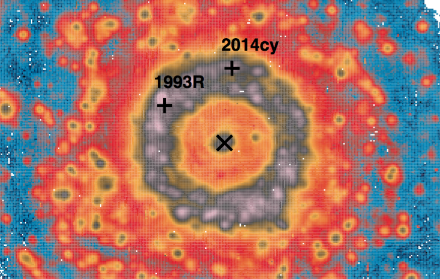

Welcome to the AMUSING survey webpage!

AMUSING uses the Multi Unit Spectroscopic Explorer (MUSE) instrument to observe galaxies that have been host to supernovae (SNe). The wide-field of view, high-spatial resolution and integral field capabilities of MUSE enables detailed studies of SN host galaxies. The AMUSING survey makes use of sub-optimal observing conditions at the Paranal observatory to obtain large samples of observations of SN host galaxies, with the aim of using such observations to further understand SN progenitors and explosions, while at the same time providing a large sample of galaxies that can be used for a variety of extra-galactic studies. 

Below are links to all our documentation. In the main these documents are open to comments for anyone within the collaboration, and then the PIs will edit the documents. 

## [Overall aims, strategy and policies, proposals](https://docs.google.com/document/d/15Q1BRXElBUJCW1tKurcagpIlyzSC7B4v4e7nynwgQdc/edit)

## [Data spreadsheet, reduction, processing and status](https://docs.google.com/spreadsheets/d/1-C4_Oi0lehvoxGQwsaD3v_Pp6kt3xE2HUm3x5K3pdOQ/edit#gid=0)

## [Data reduction, processing note. Data/data products management](https://docs.google.com/document/d/1JjUmmP942b_hjlyS4ROvxrWV7cf80U2P1myDX7oxjx4/edit)

## [AMUSING science projects](https://docs.google.com/document/d/1AQG2tHh4OZWE55jGWG0YKDsl6SD8dWmBaVoQgQo2sag/edit?usp=sharing)

## [AMUSING ideas](https://docs.google.com/document/d/1nN5eQ2aQCvSYEJQD3Von8VWh9Ub2PSrNrRsFaHfTIpg/edit?usp=sharing)

## [MUSE links](https://docs.google.com/document/d/1FLh0fIfMcmnVE-8-0LMpvrtqz2oSAxFWTf0FkBwlp3g/edit)
 
## [AMUSING github organization site](https://github.com/amusing-muse)
 
## [Other MUSE projects with related CoIs](https://docs.google.com/document/d/1VKJ_4hAK13dcmjisEprcrxKjCoLXOnHR77rB5auMgN0/edit)
 
## [Collaboration whiteboard](https://docs.google.com/document/d/1JEt9ljtPOx73zWXnbt2phEjYK4LvhO8UjN-C8vIklGg/edit)
 
## [AMUSING meetings](https://docs.google.com/document/d/1Y2N9tZAJVAfWwIM3moslywh68UhCg0JRp9q60zr61Ug/edit?usp=sharing)

